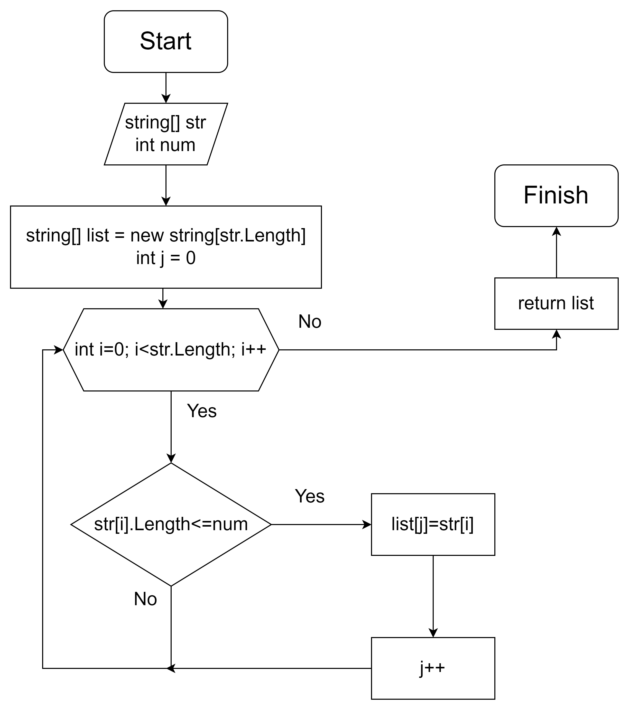

# Инструкция по выполненному заданию

## Выполняемое задание
>Задача: Написать программу, которая из имеющегося массива строк формирует новый массив из строк, длина которых меньше, либо равна 3 символам. Первоначальный массив можно ввести с клавиатуры, либо задать на старте выполнения алгоритма. При решении не рекомендуется пользоваться коллекциями, лучше обойтись исключительно массивами.

### Этапы написания программы
1. *Написание метода **"AddElements"** который, создаст и заполнит массив строками*
2. *Написание метода **"CheckElements"** который, проверит условие по длине строк,создает и заполняет новый массив строками прошедших по условию*
3. *Написание метода **"Print"** который, выводит на экран новый массив*

## Каждый этап нужно коммитить

## WEB ссылки и скрин блок схемы
Текст [ссылка на гитхаб репозиторий](https://github.com/kirin4k/Last.git "гитхаб")
### Блок схема основного метода **"CheckElements"**
![Блок схема] 